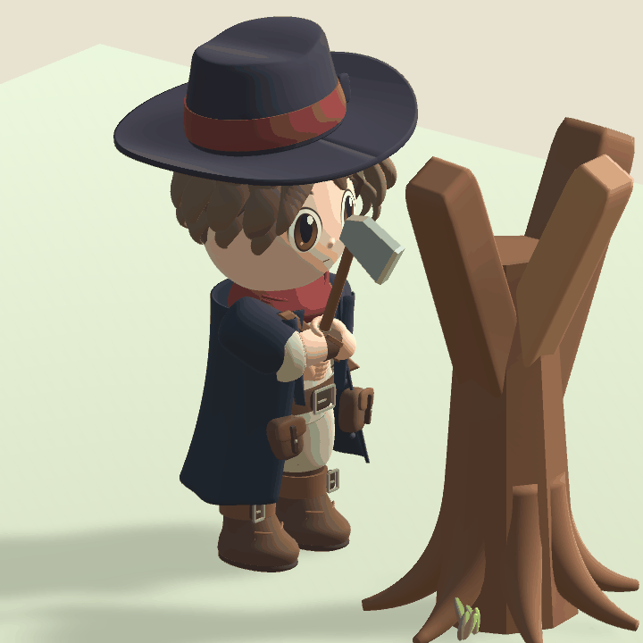
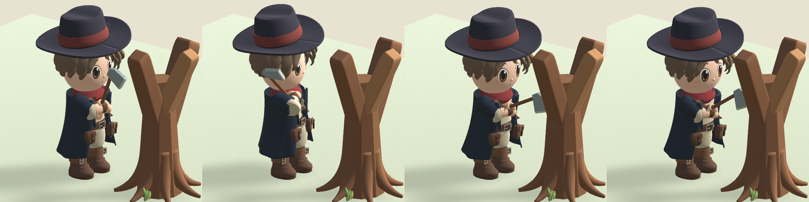

# 양손 벌목 모션

팔 전체가 한 덩어리로 돌아가던 표현을 팔꿈치·전완·손목으로 나눴다. 양손이 서로 다른 손잡이 위치를 잡고, 준비 → 어깨 옆으로 당기기 → 타격 → 복귀 순서로 움직인다. 양손용으로 자루를 늘렸으며 손목띠는 전완에 고정했다. 몸통을 틀 때 발 위치는 유지한다.

[Palia 공식 벌목 이미지](https://images.ctfassets.net/qyr5bjm559gz/7wLdzbIuaE9ESRUSNRrwdY/194c6c8753f27ac35ece88c9edb298df/foraging.jpg)의 양손 파지와 몸통 회전을 참고했다. 원본 모델이나 애니메이션 파일을 가져오지는 않았다.

## 동작 연결

- `WoodcuttingPose`는 두 관절 IK로 손 위치를 계산하고, 손 아래의 도끼 앵커를 유지한다. 런타임과 미리보기가 같은 자세 함수를 사용한다.
- `CharacterModelView`는 서버가 승인한 `StrikeSequence` 변경에만 타격을 시작한다. 복제된 이동이 발생하면 진행 동작을 중단한다. 마지막 타격으로 작업 상태가 해제돼도 승인된 동작은 표시한다.
- 동작 길이 0.56초, 시각적 타격 시점 0.29초는 표현 값이다. 서버의 타격 간격이나 피해 판정은 바꾸지 않는다.
- `TreeModelView`는 체력 감소 수신 후 타격 시점에 흔들림·소진 외형을 표시한다. 서버 상태와 Collider는 즉시 반영한다. 이미 소진된 나무에 접속하면 바로 그루터기를 보인다. 상태 패킷 사이의 지연까지 정확한 접촉 동기화를 보장하지는 않는다.

## 생성과 검증

[모델 생성 명령](village-models.md)의 BuildModels와 RenderModels를 사용한다. 렌더는 실제 프리팹과 공용 정지 거리 1.35를 사용하며, 손과 도끼를 확인하기 위해 미리보기에서만 나뭇잎을 숨긴다. 게임 장면에서는 나뭇잎을 유지한다. 36개 프레임은 `TestResults/village-models/woodcutting-frames`에 생성된다. GIF는 해당 프레임을 Pillow 12.3으로 인코딩한 것으로 로그인한 게임창 녹화는 아니다.

최종 베이크·렌더·PlayMode 55개 통과. 양손 도끼 접점, 팔꿈치·손목 연결, 발 고정, 동작 중 세 시점에서 취소 후 초기화, 반복 복원, 실제 도끼 날의 이동 방향을 확인했다. 비활성 보조 손의 메시가 저장 자산으로 교체되지 않던 오류를 기존 자산 검사로 발견했고, 비활성 자식도 연결하도록 고친 후 통과했다. 독립 코드 리뷰에서 확정 P1/P2 지적 없음.

Windows 빌드와 `scripts/test-strike-session.ps1`도 통과했다. 두 클라이언트에서 타격 간격·권한·스태미나 거절/회복·취소·소진·재생·제한시간을 확인했다. 세션 검사는 그래픽 없는 모드로 실행했으므로 실제 동작의 시각 검증은 위 Unity 프레임 렌더와 구분한다.

모든 각도의 옷·몸 간섭, 다양한 네트워크 지연에서 마지막 타격과 그루터기의 프레임 단위 동기화, 사용자 조작감, 10명 그래픽 성능은 미검증이다. 서버 동반 변경은 없으며 공용 패키지 0.7.0을 유지한다.
